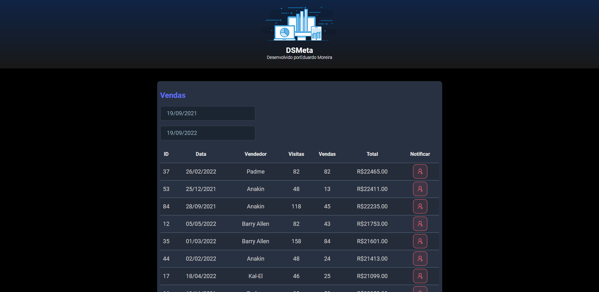

# Meta Sales SDS

#

#

Pequena dashboard alimentada pela API, simula dados de vendedores e sua performance, filtrados por data de vendas.

## 💻 Pré-requisitos

- IDE e Sistema Operacional de sua escolha
- Node ^16.16
- JDK ^17
- yarn ^1.22

## 🚀 Instalando SDS backend

- baixe e descompacte o arquivo zip
- navegue até a pasta backend
- o serviço de mensagem Twilio utiliza parâmetros sensíveis, tais como chave e número de telefone virtual da API: faça sua conta [clicando aqui](https://www.twilio.com/pt-br/docs/sms)
- configure os parâmetros locais para o serviço twillo.
- ao buildar e rodar a API, ela fornecerá um caminho local com banco de dados já semeado.

## 🚀 Instalando SDS frontend

- baixe e descompacte o arquivo zip
- navegue até a pasta frontend
- no terminal digite yarn install
- configure a variável BASE_URL no request.ts
- para rodar digite yarn dev
